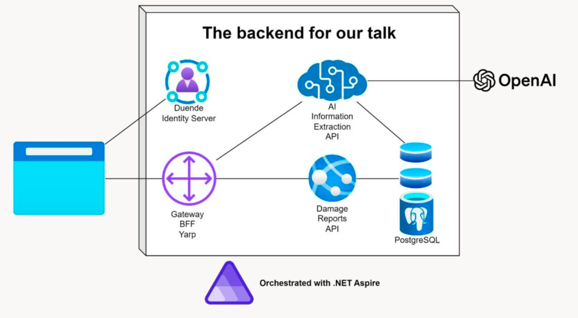

# Integrating Multimodal Language Models in .NET backends with Microsoft.Extensions.AI and .NET Aspire

*Slides and code samples for Kenny Pflug's talk held at the Advanced Developer's Conference 2025 in Regensburg, Germany.*

## Slides

The slides can be found in the root of this repository: [Accessing MLMs from .NET Backends with Microsoft.Extensions.Ai and .NET Aspire.pdf](https://github.com/feO2x/adc2025-mea-with-aspire/blob/main/Accessing%20MLMs%20from%20.NET%20Backends%20with%20Microsoft.Extensions.Ai%20and%20.NET%20Aspire.pdf)

## Code Sample

The solution contains a cloud-native backend with several services, orchestrated with .NET Aspire.



There are four ASP.NET Core services:

- **Gateway**: The entry point for the system, which forwards requests to the appropriate service (reverse proxy) and also works as a Backend-for-Frontend (BFF) for the web client.
- **Duende IdentityServer**: The identity provider for the system, which handles authentication.
- **Damage Reports API**: a CRUD API for damage reports.
- **AI Information Extraction API**: an API that performs information extraction by analyzing text, speech, and images. It uses Microsoft.Extensions.AI to call MLMs like GPT-4.1. By default, it talks to the OpenAI API, but can also be configured to run against local models using Ollama.

## How to configure the services

- If you want to run against OpenAI API, please obtain an API key and set it in the `appsettings.json` file of the `AiInformationExtractionApi` project under `ai:apiKey`.
- If you want to run against Ollama hosted in a container managed by .NET Aspire, go to `AspireAppHost/appsettings.json` and set `appHost:runOllama` to `true`. This will run result in Ollama using llama3.2-vision:11b, accessed via [Community Toolkit Ollama Integration](https://learn.microsoft.com/en-us/dotnet/aspire/community-toolkit/ollama?tabs=dotnet-cli%2Cdocker), the configuration of the `AiInformationExtractionApi` will be updated by .NET Aspire. PLEASE NOTE: Ollama cannot benefit from NPU/GPU acceleration on MacOS in this mode as MacOS cannot pass NPU/GPU resources to containers. You might also need to change the GPU-support if you run an AMD APU in `AspireAppHost/CompositionRoot` (see `WithGpuSupport` extension method).
- You can run against a local Ollama instance using `Microsoft.Extensions.AI.Ollama` instead by setting `appHost:runOllama` to `false` and adding the following settings to `AiInfromationExtractionApi/appsettings.json`:

```json
{
    "ai": {
        "textVisionService": "MeaOllama",
        "textVisionModel": "mistral-small3.1:latest",
        "apiKey": "<your Open AI API key>"
    },
    "connectionStrings": {
        "MeaOllama": "http://localhost:11434"
    }
}
```

The JSON above uses the Mistral Small 3.1 32B model, but of course, you can use any model you like.

Please note that for Speech analysis, you still need to use an OpenAI API key, as Ollama does not support speech models yet. [Speaches](https://github.com/speaches-ai/speaches) might be a good alternative, but it is not integrated yet into this sample.

## How to run the integration tests

Once you have configured the services, you can run the integration tests of the `AspireAppHost.IntegrationTests` project. There is one for text analysis, speech analysis, and image analysis.